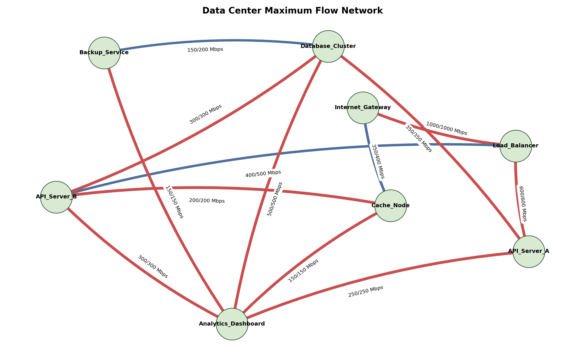

# Data Center Maximum Flow Optimization

This project solves a network optimization problem in a Management Information Systems context. It models a cloud data center network and calculates the maximum amount of traffic that can be sent from an internet gateway to an analytics dashboard service.

## Problem Context

A company uses a cloud-based information system for operational analytics. User requests enter through an `Internet_Gateway`, pass through infrastructure components such as a load balancer, API servers, cache node, database cluster, and backup service, and finally reach the `Analytics_Dashboard`.

The management decision problem is:

> What is the maximum possible traffic capacity, in Mbps, that the data center network can deliver from the internet gateway to the analytics dashboard?

This is formulated as a **Maximum Flow Problem**, where each directed connection has a capacity limit.

## Dataset

The network data is stored in `data_edges.csv`.

| Column | Meaning | Unit |
| --- | --- | --- |
| `source` | Starting node of a directed network connection | Node name |
| `target` | Ending node of a directed network connection | Node name |
| `capacity_mbps` | Maximum traffic that can pass through the connection | Megabits per second (Mbps) |
| `description` | Business meaning of the connection | Text |

The dataset is hypothetical but realistic for a small data center traffic model. It includes 8 nodes and 13 directed edges, satisfying the assignment requirement of at least 6 nodes and 8 edges.

## Method

The project uses Python and the `NetworkX` library to solve the maximum flow model. The source node is:

```text
Internet_Gateway
```

The sink node is:

```text
Analytics_Dashboard
```

The algorithm calculates:

- the total maximum flow from source to sink
- the flow assigned to each directed edge
- saturated edges where the assigned flow equals the edge capacity

## How to Run

Install the required packages:

```powershell
pip install -r requirements.txt
```

Run the project:

```powershell
python main.py
```

You can also provide custom paths and terminal nodes:

```powershell
python main.py --data data_edges.csv --source Internet_Gateway --sink Analytics_Dashboard --plot outputs/data_center_flow.png
```

## Output

The console output shows the maximum network flow in Mbps, each edge's flow compared with its capacity, and the saturated edges.

The script also saves a network visualization to:

```text
outputs/data_center_flow.png
```



In the plot, each directed edge is labeled as:

```text
flow/capacity Mbps
```

Red edges indicate saturated links.

## Assumptions

- The data center network is represented as a directed graph because traffic direction matters.
- Each edge capacity is measured in Mbps.
- Capacities are hypothetical but selected to be realistic for a simplified cloud infrastructure example.
- The model focuses only on throughput capacity, not cost, latency, packet loss, or security risk.
- Traffic can be split across multiple available paths from source to sink.
